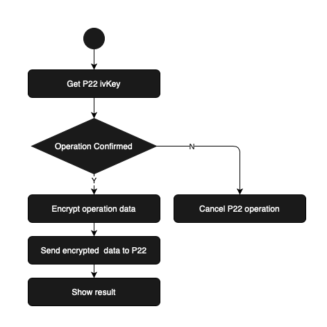

#   SecuXPaymentKitSample  
The secux-paymentkit-sample-for-springtrees-ios is a sample APP for showing how to scan
the QRCode from P22 and confirm the promotion / payment / refill to the P22 device via secux-paymentkit-v2. 

<a href="https://drive.google.com/file/d/1TMAJQEP6q--5tdQwvO-PybRtIWePH36v/view?usp=sharing">APK download</a>

# secux-paymentkit-v2

[](https://jitpack.io/#secuxtech/secux-paymentkit-v2-android)

## Requirements

* Minimum SDK Version: 24

### Add JitPack repository

```java
allprojects {
    repositories {
        ...
        maven { url 'https://jitpack.io' }
    }
}
```

### Add dependency secux-paymentkit-android

```java
dependencies {
    implementation 'com.github.secuxtech:secux-paymentkit-v2-android:{version}'
}
```
### Add bluetooth privacy permissions

Add permission to the AndroidManifest.xml

    <uses-permission android:name="android.permission.BLUETOOTH"/>
    <uses-permission android:name="android.permission.BLUETOOTH_ADMIN"/>
    <uses-permission android:name="android.permission.INTERNET"/>
    <uses-permission android:name="android.permission.ACCESS_COARSE_LOCATION"/>
    <uses-permission android:name="android.permission.ACCESS_FINE_LOCATION"/>

Request permission

```java
    if (Build.VERSION.SDK_INT >= Build.VERSION_CODES.M) {
        if (this.checkSelfPermission(Manifest.permission.ACCESS_FINE_LOCATION) != PackageManager.PERMISSION_GRANTED) {
            requestPermissions(new String[]{Manifest.permission.ACCESS_FINE_LOCATION}, 1);
        }
    }
```

### Import the the module

```java 
import com.secuxtech.paymentkit.*;
```

## Usage

### SecuXAccount related operations

Use SecuXAccountManager object to do the operations below
```java

private SecuXAccountManager mAccountManager = new SecuXAccountManager();

```

1. <b>Merchant login</b>

Must login the assigned merchant account before calling payment related APIs.

Note: <span style="color:red">Login session is valid for 30 minutes</span>. To continue use after 30 minutes, relogin is required.

SecuX Server API:
<a href="https://documenter.getpostman.com/view/9715663/SzfDvj4S?version=latest#76b3bbc9-2853-42c4-823b-3e0d47d58cf6">/api/Admin/Login</a>

#### <u>Declaration</u>
```java
    Pair<Integer, String> loginMerchantAccount(String accountName, String accountPwd)
```
#### <u>Parameter</u>
```
    accountName:    Merchant account name.
    accountPwd:     Merchant account password.
```

#### <u>Return value</u>
```
    The first return value shows the operation result. If the result is SecuXRequestOK,
    registration is successful, otherwise the second return value contains an error message.
```

#### <u>Sample</u>
```java
    Pair<Integer, String> ret = mAccountManager.loginMerchantAccount(name, pwd);
    if (ret.first == SecuXServerRequestHandler.SecuXRequestOK) {
        return true;
    }

    Log.i("", "Login merchant account failed! error:" + ret.second);

```

### SecuXPayment related operations

Use SecuXPaymentManager object to do the operations below

```java
    SecuXPaymentManager mPaymentManager = new SecuXPaymentManager();
```

1. <b>Get store information</b>

Get store information via the hashed device ID in P22 QRCode.

SecuX Server API:
<a href="https://documenter.getpostman.com/view/9715663/SzfDvj4S?version=latest#136613f8-648a-4c76-b4bc-9edc00943aad">/api/Terminal/GetStore</a>

#### <u>Declaration</u>
```java
    Pair<Pair<Integer, String>, SecuXStoreInfo> getStoreInfo(String devIDHash)
```
#### <u>Parameter</u>
```
    devID: Hashed device ID from getDeviceInfo function
```
#### <u>Return value</u>
```
    The first return value shows the operation result. If the result is SecuXRequestOK, 
    getting store information is successful, the second SecuXStoreInfo contrains store 
    information, otherwise the first return string value contains an error message.

    Note: if the first return result is SecuXRequestUnauthorized, 
    the login session is timeout, please relogin the system.

```
#### <u>Sample</u>
```java
    Pair<Pair<Integer, String>, SecuXStoreInfo> storeInfoRet = mPaymentManager.getStoreInfo(mDevIDhash);
```

2. <b>Do promotation / payment / refill operation</b>

Confirm the promotation/payment/refill operation to the P22 device.



SecuX Server API:

- Encrypt operation data 
<a href="https://documenter.getpostman.com/view/9715663/SzfDvj4S?version=latest#ff393d68-3045-451f-b175-3721f3281d74">/api/B2B/ProduceCipher</a>

SecuX Device APIs:

Please refer to the 
<a href="https://github.com/secuxtech/secux-paymentdevicekit-v2-android">secux_paymentdevicekit</a> 
for the APIs below:

- Get P22 ivKey API

- Cancel operation 

- Send encrypted operation data to P22 API

#### <u>Declaration</u>
```java
    Pair<Integer, String> doActivity(Context context, String userID, String devID, 
                                        String coin, String token, 
                                        String transID, String amount, 
                                        String nonce,
                                        String type)
```
#### <u>Parameter</u>
```
    context:    Current activity context.
    userID:     Merchant account name.
    devID:      Current device ID, which can be get via getStoreInfo API
    coin:       Coin info. from the QRCode.
    token:      Token info. from the QRCode.
    transID:    Transaction ID assigned by merchant. 
    amount:     Amount info. from the QRCode.
    nonce:      Nonce info. from the QRCode. 
    type:       Activity type: promotion / payment / refill.
```
#### <u>Sample</u>

```swift
    Pair<Integer, String> verifyRet = mPaymentManager.doActivity(this, this.mAccountName, 
                                                                    storeInfo.mDevID,
                                                                    coin, 
                                                                    token, 
                                                                    transID,
                                                                    amount, 
                                                                    nonce, 
                                                                    type);

    if (verifyRet.first == SecuXServerRequestHandler.SecuXRequestUnauthorized){
        if (!login(this.mAccountName, this.mAccountPwd)){
            return;
        }
        verifyRet = mPaymentManager.doActivity(this, this.mAccountName, storeInfo.mDevID,
                                            coin, token, 
                                            transID, amount, 
                                            nonce, type);
    }
```

## Author

SecuX, maochunsun@secuxtech.com

## License

SecuXPaymentKit is available under the MIT license.
